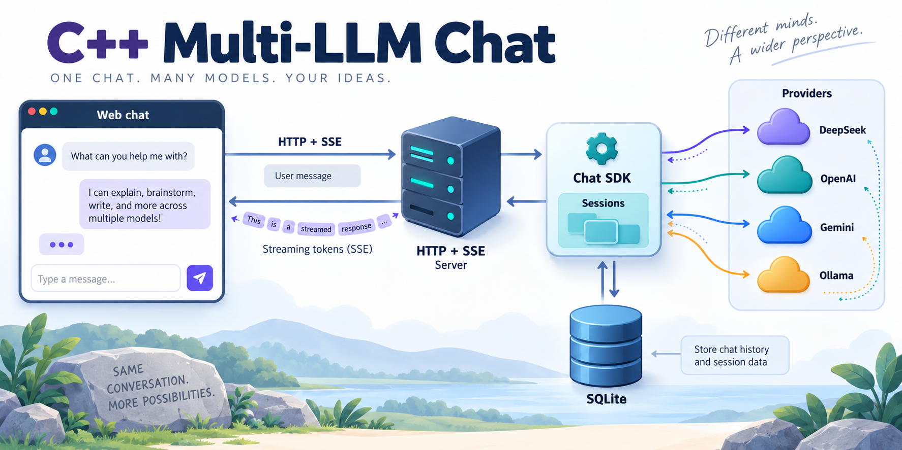
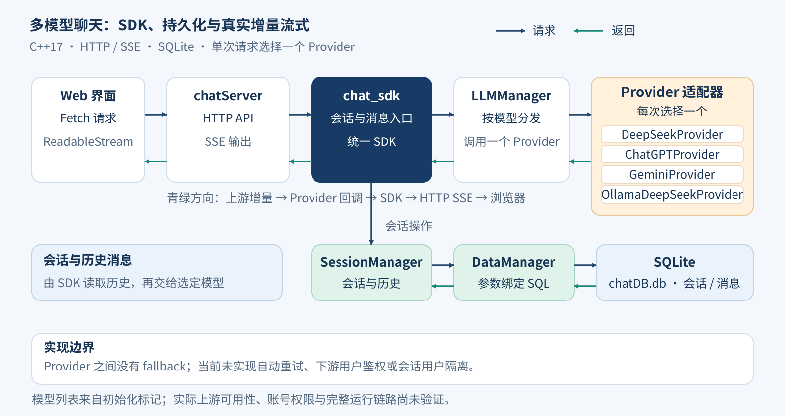

# C++ Multi-LLM Chat



一个由 C++17 SDK、HTTP 服务和原生 Web 前端组成的多模型聊天学习项目，统一封装云端与本地 Provider，并使用 SQLite 保存会话和消息历史。

代码包含完整的主要聊天调用链路。下文以当前实现为准；干净环境构建、全部模型的真实响应和部署可靠性尚未复核。

## 已实现的能力

- **统一 Provider 接口**：DeepSeek、ChatGPT、Gemini 和 Ollama 四类适配器。
- **非流式与流式调用**：上游增量响应经 Provider 回调传递，再由 HTTP 服务封装为 SSE。
- **会话管理**：创建、列出、读取历史、删除会话。
- **本地持久化**：SQLite 会话/消息表、索引和参数绑定查询。
- **Web 对话界面**：模型选择、会话切换、实时消息显示、Markdown/代码展示。
- **运行配置**：监听地址、端口、日志级别、温度、输出长度及 Ollama 参数。

Provider 已有实现不等于当前账号与模型一定可调用。云端模型名和部分端点写在源码中，需按实际服务权限与协议核对。

## 架构



```text
Web 前端
  → chatServer（cpp-httplib HTTP / SSE）
  → chat_sdk（会话与消息主接口）
  ├── SessionManager → DataManager → SQLite
  └── LLMManager → LLMProvider
                   ├── DeepSeekProvider
                   ├── ChatGPTProvider
                   ├── GeminiProvider
                   └── OllamaDeepSeekProvider
```

流式调用向上游发送 `stream=true`，用 HTTP 内容接收回调解析增量并立即向客户端转发。前端通过 Fetch ReadableStream 读取 SSE；这条链路不是收到完整回复后再逐字模拟。

## 目录

```text
chatsdk/
├── include/                 SDK、Provider、会话与存储接口
├── src/                     对应实现
└── CMakeLists.txt           ai_chat_sdk 静态库与安装规则
chatServer/
├── main.cpp                 参数解析、环境变量与启动入口
├── chatServer.cpp/.h        HTTP API、SSE 与服务生命周期
├── CMakeLists.txt
└── www/                     HTML、CSS 与原生 JavaScript 前端
test/
├── testLLM.cpp              GTest 示例及真实上游交互测试
└── CMakeLists.txt
docs/images/                项目概览与架构图
```

## 环境与依赖

当前构建方式面向 Linux，文档中的命令以 Ubuntu/Debian 和 `/usr/local` 安装前缀为例。

| 依赖 | 用途 |
| --- | --- |
| C++17 编译器、CMake 3.15+ | 构建 SDK、服务器与测试；源码声明最低 3.10，但本文命令使用 3.15 起提供的安装选项 |
| cpp-httplib 的 httplib.h | HTTP 客户端、服务器与内容接收回调 |
| OpenSSL | 上游 HTTPS |
| jsoncpp | JSON 请求与响应 |
| SQLite3 | 会话与消息持久化 |
| fmt、spdlog | 日志和格式化 |
| gflags、Threads/pthread | 服务参数与线程 |
| GoogleTest（可选） | 构建 test/ 下的示例测试 |
| Ollama（使用本地 Provider 时） | 本地模型服务 |

```bash
sudo apt update
sudo apt install build-essential cmake libjsoncpp-dev libfmt-dev \
  libspdlog-dev libsqlite3-dev libgflags-dev libssl-dev curl
```

**还需单独准备 cpp-httplib。** 仓库未提交 `httplib.h`，也未锁定兼容版本。请从 [cpp-httplib 官方仓库](https://github.com/yhirose/cpp-httplib) 准备头文件，放到编译器可搜索目录，例如 `/usr/local/include/httplib.h`。所选版本必须兼容源码中 `Request::content_receiver` 的四参数回调、`set_chunked_content_provider` 和 `Client::send`；本项目尚未记录已验证的依赖版本组合。若使用把 httplib 拆为头文件和共享库的系统包，需要额外核对其链接要求。

## 获取、构建与安装

```bash
git clone https://github.com/759stronger/cpp-multi-llm-chat.git
cd cpp-multi-llm-chat
cmake -S chatsdk -B build/sdk -DCMAKE_INSTALL_PREFIX=/usr/local
cmake --build build/sdk --parallel
sudo cmake --install build/sdk
cmake -S chatServer -B build/server
cmake --build build/server --parallel
```

SDK 的安装规则会生成 `/usr/local/lib/libai_chat_sdk.a` 和 `/usr/local/include/ai_chat_sdk/`。服务器按安装后的头文件与库名引用 SDK，因此应先完成 SDK 安装。

### 构建检查

当前 `chatsdk/CMakeLists.txt` 的 OpenSSL 链接项写为 `OpenSSL:SSL`、`OpenSSL:Crypto`，与服务器及测试中使用的导入目标写法不同。建议将该行整理为：

```cmake
target_link_libraries(${SDK_NAME}
  jsoncpp fmt spdlog sqlite3 OpenSSL::SSL OpenSSL::Crypto)
```

这是需要检查的源码配置，不是本 README 已替你完成的修改。SDK 本身是静态库，服务器另行链接 OpenSSL，因此不能仅凭该拼写就断言当前构建一定失败。遇到编译或链接失败时，先检查 `httplib.h` 的版本、SDK 安装位置和实际链接输出。

本仓库未提供已验证的一键安装脚本或锁定依赖环境；上述命令由现有构建文件推导，尚未在干净环境执行验证。

## 配置与运行

实际密钥入口是以下**小写环境变量**：

- `deepseek_api_key`
- `chatgpt_api_key`
- `gemini_api_key`

**当前 main 要求三项云端密钥全部非空。** 缺少任意一项会退出，即使你只打算使用 Ollama。上游密钥配置与访问本服务的用户鉴权是不同功能；当前没有下游用户鉴权。

在准备好凭据的终端中设置环境变量。下面仅为占位示例：

```bash
export deepseek_api_key="<your-deepseek-key>"
export chatgpt_api_key="<your-chatgpt-key>"
export gemini_api_key="<your-gemini-key>"
```

请勿把真实密钥提交到仓库。随后从 `chatServer` 目录启动，以保证 `./www` 静态资源路径正确：

```bash
cd chatServer
../build/server/AIChatServer --host=127.0.0.1 --port=8080
```

打开 [http://127.0.0.1:8080](http://127.0.0.1:8080)。运行目录下会创建或读取 `chatDB.db`。

| 参数 | 默认值 | 说明 |
| --- | --- | --- |
| --host | 0.0.0.0 | 建议本地演示显式设置为 127.0.0.1 |
| --port | 8080 | HTTP 监听端口 |
| --log_level | DEBUG | DEBUG / INFO / WARN / ERROR |
| --temperature | 0.7 | 入口检查范围为 0–1 |
| --max_tokens | 2048 | 入口要求大于 0 |
| --ollama_endpoint | http://127.0.0.1:11434 | Ollama 地址 |
| --ollama_model_name | deepseek-r1:1.5b | 本地模型名 |
| --config_file | chatServer.conf | 非密钥参数的配置文件路径 |

`chatServer.conf` 可写入 gflags 风格参数，例如：

```text
--host=127.0.0.1
--port=8080
--ollama_endpoint=http://127.0.0.1:11434
--ollama_model_name=deepseek-r1:1.5b
```

该文件不会替代 main 中从环境变量读取密钥的逻辑。服务中的 ChatGPT/Gemini Provider 固定使用本机 HTTP 代理 `127.0.0.1:7890`；ChatGPT 默认端点是第三方服务。运行前应核对代理、上游归属、授权与协议，必要时调整源码配置后重新构建。

## HTTP API

| 方法与路径 | 功能 |
| --- | --- |
| GET /api/models | 返回代码标记为可用的模型列表 |
| POST /api/sessions | 创建会话，请求体含 model |
| GET /api/sessions | 获取所有会话 |
| GET /api/sessions/{id}/history | 获取会话历史 |
| DELETE /api/sessions/{id} | 删除会话 |
| POST /api/message | 非流式消息，请求体含 session_id、message |
| POST /api/message/async | SSE 流式消息，结束标记为 data: [DONE] |

这些是项目自有 API；当前并非一个对外提供 `/v1/chat/completions` 的通用 OpenAI 兼容网关。

## 最小验证

服务启动后，先验证静态页面和模型列表；这些请求不会发送聊天消息给上游：

```bash
curl -i http://127.0.0.1:8080/
curl -i http://127.0.0.1:8080/api/models
```

预期：页面请求返回 HTML；模型接口返回 JSON。模型列表中的“可用”来自初始化标记，不能作为真实连通性或账号权限验证。

如需验证持久化链路，可用模型列表中的一个名称创建会话，再查询和删除该会话：

```bash
curl -i -X POST http://127.0.0.1:8080/api/sessions \
  -H 'Content-Type: application/json' \
  -d '{"model":"deepseek-r1:1.5b"}'
curl -i http://127.0.0.1:8080/api/sessions
```

创建接口返回的 `data.session_id` 可用于历史查询和删除：

```bash
curl -i "http://127.0.0.1:8080/api/sessions/<session-id>/history"
curl -i -X DELETE "http://127.0.0.1:8080/api/sessions/<session-id>"
```

将 `<session-id>` 替换为返回的实际 ID。聊天和 SSE 验证会调用真实上游并可能产生费用；准备好模型、代理与账号权限后，再通过页面或消息 API 验证。本 README 未记录这些步骤已经通过。

## 测试与当前边界

- `test/` 使用 GoogleTest，但大部分 Provider 用例处于注释状态；启用的聊天测试需要真实上游和终端输入，不是独立离线回归测试。
- 四类适配器有实际调用实现，但上游模型名称、请求/响应兼容性与完整流式错误处理尚未逐一验证。
- 有连接和读取超时，尚未实现自动重试、跨 Provider fallback、调用限额或用量计费。
- API 没有用户身份、会话归属和下游鉴权。默认监听所有地址；公网或共享部署前需要补齐访问控制及部署保护。
- `--enable_ssl` 虽存在于参数定义中，服务器当前仍创建普通 `httplib::Server`，不能据此宣称启用了 HTTPS。
- 初始化主要设置模型可用标记；服务器启动状态也没有完整反映后台监听失败。日志显示成功不能替代 HTTP 探测。
- 没有已提交的 CI、固定依赖版本组合或完整可重复的构建与运行验证记录。

## 后续完善

1. 固定 cpp-httplib 与其他依赖版本，修整构建配置并补离线 Mock 测试。
2. 校验各 Provider 的非流式/流式协议、失败结束信号和模型配置。
3. 加入下游鉴权、会话隔离、重试策略和服务生命周期验证。
4. 再逐步扩展为具有路由、账号池、限流和用量记录的 AI 网关。

## 许可证

原 README 声明 MIT；当前未附独立 LICENSE 文件。建议补齐授权文本后再分发或复用。
